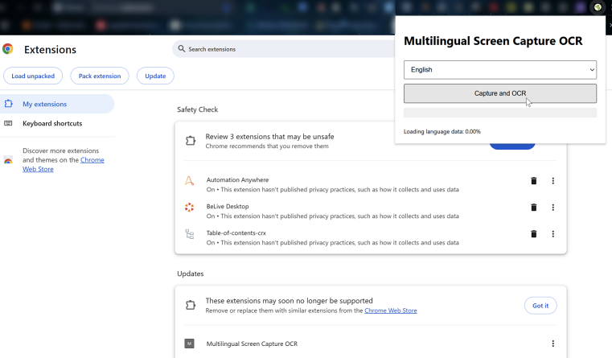
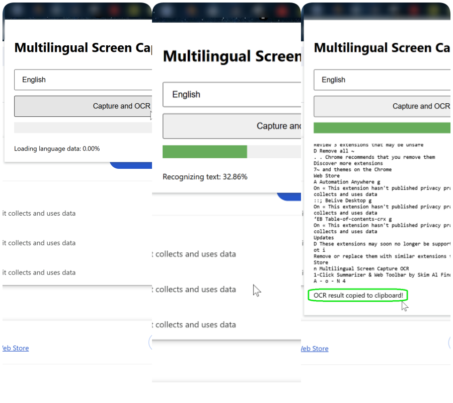
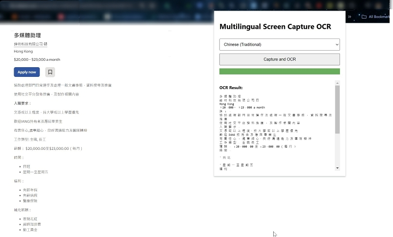

# Multilingual-Screen-Capture-OCR
## For the previous version 
ver.1_ [Dinosaur Simple Screen Capture](https://chromewebstore.google.com/detail/dinosaur-simple-screen-ca/ihlghidaealabapfnljlafbkeiidlbjl)- the Chrome extension for screen capture.

Chrome extension that can initiate screen capture when you click on the button.
It then captures a single frame as an image when the user selects that browser tab.

## For this 2nd version, we further ...
Grep the image content (textual) in any Language via text recognition (OCR), and clipboard saving for later use.. This is an interesting project that combines several technologies.

This implementation uses English ('eng') as the default language. You can add support for other specific language data to recognize text.
It will capture the current tab image and perform OCR directly in the browser.
Once the OCR is complete, it will display the extracted text in the popup hangover window and save as in the clipboard automatically

•  It's free to use. 

 

 

